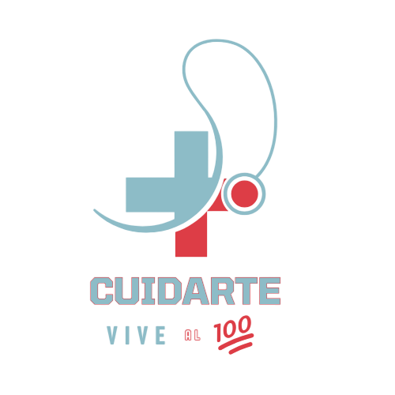

<a name="readme-top"></a>

<div align="center">
<p>
  
</p>
</div>

## Description:

Comprehensive hospital management system that includes patient management, electronic medical records,
appointment scheduling, medical inventory management, billing, basic telemedicine,
and medical analytics.

## 🎨 Tools:
- [![prima/client-logo]][prima/client-url]- Prisma client, used to interact with the database.
- [![dotenv-logo]][dotenv-url]- Dotenv, used to manage environment variables.
- [![event-logo]][event-url]- Event Emitter, used for handling events.
- [![express-logo]][express-url]- Express.js, a web application framework for Node.js.
- [![helmet-logo]][helmet-url]- Helmet, a middleware for securing Express apps.
- [![uuid-logo]][uuid-url]- UUID, a library for generating unique identifiers.
- [![winston-logo]][winston-url]- Winston, a logging library for Node.js.
- [![zod-logo]][zod-url]- Zod, a schema validation library for TypeScript.

[prima/client-logo]: https://img.shields.io/badge/Prisma-000000?style=for-the-badge&logo=prisma
[prima/client-url]: https://www.prisma.io/
[dotenv-logo]: https://img.shields.io/badge/Dotenv-000000?style=for-the-badge&logo=dotenv
[dotenv-url]: https://github.com/motdotla/dotenv
[event-logo]: https://img.shields.io/badge/Event--Emitter-000000?style=for-the-badge&logo=eventemitter3
[event-url]: https://nodejs.org/api/events.html
[express-logo]: https://img.shields.io/badge/Express.js-000000?style=for-the-badge&logo=express
[express-url]: https://expressjs.com/
[helmet-logo]: https://img.shields.io/badge/Helmet-000000?style=for-the-badge&logo=helmet
[helmet-url]: https://helmetjs.github.io/
[uuid-logo]: https://img.shields.io/badge/UUID-000000?style=for-the-badge&logo=uuid&logoColor=white
[uuid-url]: https://www.npmjs.com/package/uuid
[winston-logo]: https://img.shields.io/badge/Winston-000000?style=for-the-badge&logo=winston
[winston-url]: https://github.com/winstonjs/winston
[zod-logo]: https://img.shields.io/badge/Zod-000000?style=for-the-badge&logo=zod
[zod-url]: https://zod.dev/
## Run Locally

Clone the project

```bash
  git clone https://github.com/Daniell-Estrada/MedCore-admin-audit.git
```

Go to the project directory

```bash
  cd MedCore-admin-audit
```

Install dependencies

```bash
  npm install
```

Start the server

```bash
  npm run dev
```


## 🚀 About Development Team

- **Naghelly M.** - Scrum Master
- **Jesus A.** - Backend Developer
- **Nicolas C.** - Frontend Developer
- **Daniel E.** - Infrastructure Engineer / QA Engineer
</div>
